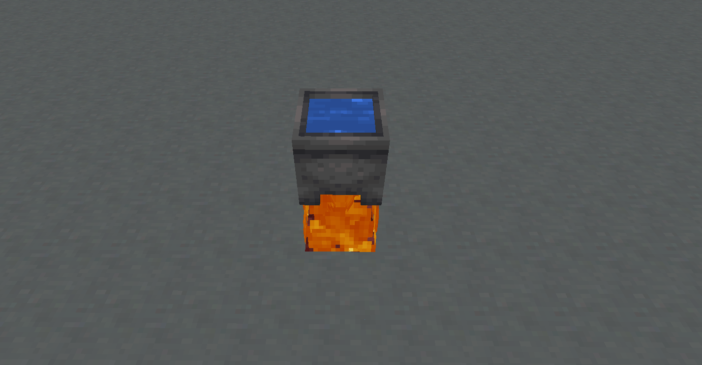
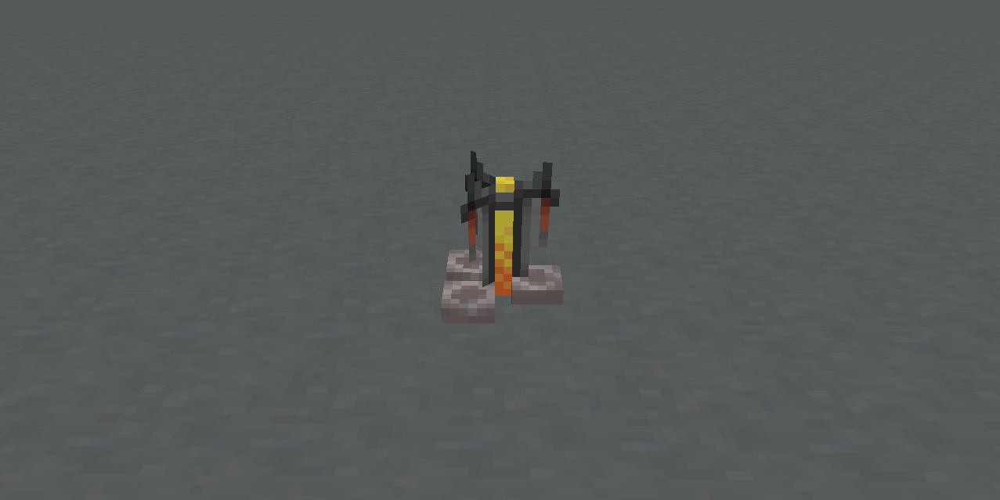
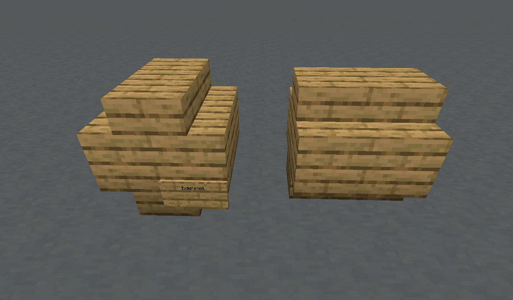
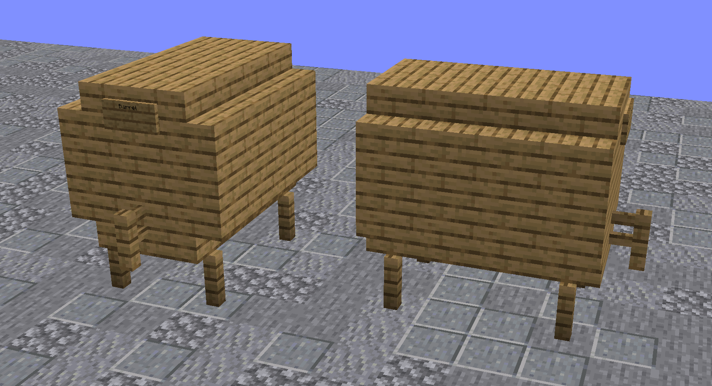

# Алкоголизм

На нашем сервере вы можете варить различные алкогольные напитки, что добавляет интересный элемент игрового процесса.

### Процесс приготовления 

В отличие от обычного Minecraft, приготовление алкоголя здесь превращается в увлекательный и многослойный процесс. В зависимости от рецепта придётся пройти несколько этапов с высокой точностью - любая ошибка может повлиять на качество напитка и вызвать различные побочные эффекты.

Сложность создания качественных напитков делает их особенно ценными на сервере и побуждает экспериментировать с рецептами. При этом некоторые рецепты могут обходиться без выполнения всех описанных ниже шагов.

### Ферментация 

Первый этап - ферментация свежих ингредиентов:

1. Установите котёл над огнём или другим источником тепла
2. Наполните его водой
3. Добавьте ингредиенты правым кликом
4. Подождите несколько минут, пока ингредиенты будут бродить
5. Разлейте смесь по стеклянным бутылкам

<figure><figcaption></figcaption></figure>

### Дистилляция 

Некоторые рецепты требуют дистилляции:

1. Поместите  бутылку с закваской в варочную стойку
2. Добавьте светокаменную пыль в качестве фильтра сверху (фильтр не расходуется)

<figure><figcaption></figcaption></figure>

### Выдержка 

**Маленькая бочка** (9 слотов)

Чтобы создать маленькую бочку:

* Используйте 8 деревянных ступеней, расположив их в форме бочки
* Поставьте табличку в правом нижнем углу и напишите "Barrel" в верхней строке

<figure><figcaption></figcaption></figure>

**Большая бочка** (27 слотов)

Для создания большой бочки:

* Используйте 5 заборов, 16 деревянных ступеней и 18 деревянных досок
* Прикрепите кран (забор) и табличку с надписью "Barrel"

<figure><figcaption></figcaption></figure>

**Чтобы разобрать бочку, просто сломайте табличку.**

Как использовать бочку:

* Откройте её, кликнув по ней
* Поместите бутылки внутрь для выдержки
* За каждый игровой день напиток выдерживается один год
* Тип древесины бочки может влиять на качество напитка (зависит от рецепта)
* Стандартная бочка всегда изготавливается из дуба

### Употребление напитков 

При употреблении алкогольных напитков вы получите различные эффекты:

* Затруднение движения (шатание при ходьбе)
* Возможные эффекты слепоты, спутанности сознания, отравления
* Изменение текста в чате (слова могут искажаться)
* Особо крепкие напитки могут вызвать отравление

### Как протрезветь 

После употребления алкоголя потребуется время, чтобы его действие прошло. Вы можете ускорить этот процесс:

* Выпейте молоко (или кофе)
* Съеште хлеб

### Рецепты напитков 

#### Пиво и Эли 

| Рецепт         | Ингредиенты     | Время варки | Дистилляция | Выдержка/Древесина  | Крепость |
| -------------- | --------------- | ----------- | ----------- | ------------------- | -------- |
| Пшеничное пиво | Пшеница - 3 шт. | 8 мин.      | Нет         | 2 дня (Берёза)      | 5%       |
| Пиво           | Пшеница - 6 шт. | 8 мин.      | Нет         | 3 дня (Любая)       | 6%       |
| Тёмное пиво    | Пшеница - 6 шт. | 8 мин.      | 3 раза      | 8 дней (Тёмный дуб) | 7%       |

#### Вина и Медовухи 

| Рецепт            | Ингредиенты                               | Время варки | Дистилляция | Выдержка/Древесина | Крепость |
| ----------------- | ----------------------------------------- | ----------- | ----------- | ------------------ | -------- |
| Красное вино      | Сладкие ягоды - 5 шт.                     | 5 мин.      | Нет         | 20 дней (Любая)    | 8%       |
| Медовуха          | Тростник - 6 шт.                          | 3 мин.      | Нет         | 4 дня (Дуб)        | 9%       |
| Яблочная медовуха | 
Тростник - 6 шт. Яблоко - 2 шт.
 | 4 мин.      | Нет         | 4 дня (Дуб)        | 11%      |
| Яблочный сидр     | Яблоки - 14 шт.                           | 7 мин.      | Нет         | 3 дня (Любая)      | 7%       |
| Яблочный ликёр    | Яблоки - 12 шт.                           | 16 мин.     | 3 раза      | 6 дней (Акация)    | 14%      |

#### Крепкие напитки 

| Рецепт | Ингредиенты                                                     | Время варки | Дистилляция | Выдержка/Древесина | Крепость |
| ------ | --------------------------------------------------------------- | ----------- | ----------- | ------------------ | -------- |
| Виски  | Пшеница - 10 шт.                                                | 10 мин.     | 2 раза      | 18 дней (Ель)      | 26%      |
| Ром    | Тростник - 18 шт.                                               | 6 мин.      | 2 раза      | 14 дней (Дуб)      | 30%      |
| Водка  | Картофель - 10 шт.                                              | 15 мин.     | 3 раза      | Нет                | 20%      |
| Текила | Кактус - 8 шт.                                                  | 15 мин.     | 2 раза      | 12 дней (Берёза)   | 20%      |
| Джин   | 
Пшеница - 9 шт. Синие цветы - 6 шт. Яблоко - 1 шт.
 | 6 мин.      | 2 раза      | Нет                | 20%      |
| Абсент | Трава - 15 шт.                                                  | 3 мин.      | 6 раз       | Нет                | 42%      |

#### Особые и Безалкогольные 

| Рецепт           | Ингредиенты                                     | Время варки | Дистилляция | Особенности    | Эффекты         |
| ---------------- | ----------------------------------------------- | ----------- | ----------- | -------------- | --------------- |
| Огненный виски   | 
Пшеница - 10 шт. Огн. порошок - 2 шт.
 | 12 мин.     | 3 раза      | 18 дней (Ель)  | Алкоголь 28%    |
| Кофе             | 
Какао-бобы - 12 шт. Молоко - 2 вед.
   | 2 мин.      | Нет         | Отрезвляет     | Скорость, Реген |
| Горячий шоколад  | Печенье - 3 шт.                                 | 2 мин.      | Нет         | Безалкогольный | Спешка          |
| Картофельный суп | 
Картофель - 5 шт. Трава - 3 шт.
       | 3 мин.      | Нет         | Безалкогольный | Лечение         |
