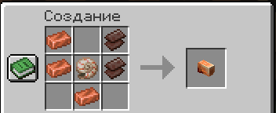
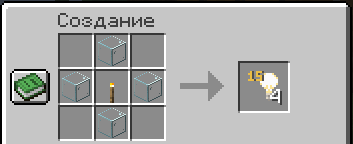
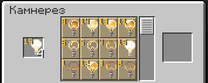

# Кастомные крафты

На сервере доступны уникальные предметы - каждый из них обладает собственными особенностями и уникальной механикой использования.

### Клешня краба

**Клешня краба** - предмет, дающий возможность взаимодействовать с блоками на +3 блока.

Возьмите **клешню краба** в дополнительную руку - увеличенная дистанция действует автоматически.

<figure><figcaption></figcaption></figure>

### Невидимый свет

<figure><figcaption></figcaption></figure>

<figure><figcaption></figcaption></figure>

