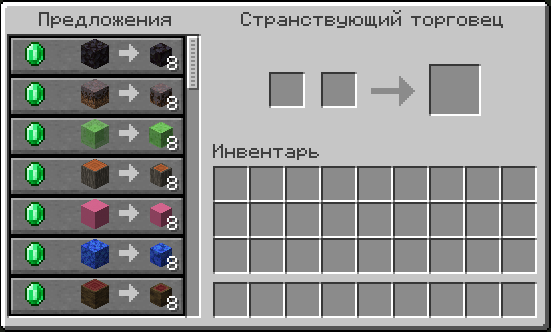

# Мини-блоки

Мини-блоки - это уменьшенные декоративные версии обычных блоков для украшения ваших построек.

***

### Как получить?

Мини-блоки можно приобрести у **странствующего торговца**. Ассортимент меняется при каждом появлении торговца.

