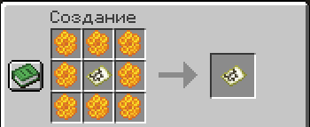
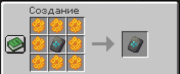

# Некопируемые арты и шаблоны

На сервере можно защитить свои творения от копирования - это полезно для продажи уникальных предметов.

***

### Защита мапарта

Чтобы сделать карту некопируемой, скрафтите её с определёнными ингредиентами:

<figure><figcaption></figcaption></figure>

***

### Защита шаблона брони

Чтобы защитить шаблон от копирования:

<figure><figcaption></figcaption></figure>

