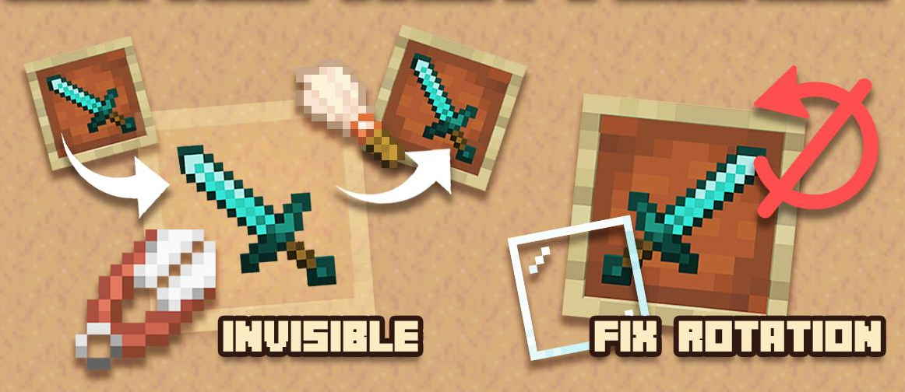

# Невидимые рамки

Невидимые рамки позволяют красиво размещать предметы без видимой рамки - идеально для декора.

***

### Как сделать рамку невидимой? 

1. Разместите рамку
2. Положите в неё предмет
3. **Зажмите Shift** и **кликните ПКМ** по рамке ножницами, чтобы сделать рамку невидимой.
4. **Зажмите Shift** и **кликните ПКМ** по рамке кистью, чтобы вернуть рамку в обычное состояние.
5. **Зажмите Shift** и **кликните ПКМ** по рамке стеклянной панелью, чтобы заблокировать вращение рамки предмета.

<figure><figcaption></figcaption></figure>

