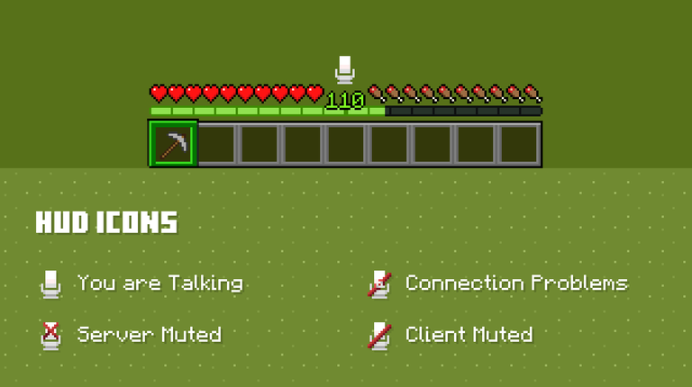
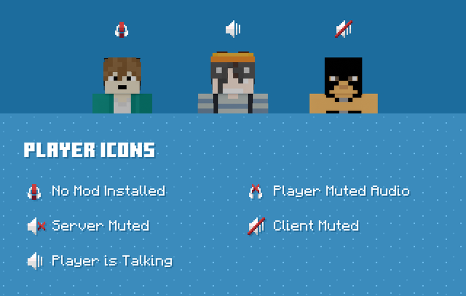
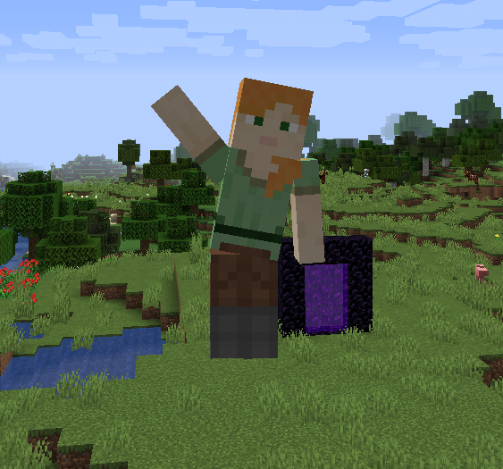

# PlasmoVoice и EmoteCraft

На сервере установлены моды для расширенного общения между игроками

***

### PlasmoVoice - голосовой чат

Позволяет общаться голосом с другими игроками прямо в игре. Поддерживаются все официальные аддоны. 

**Возможности:**

1. Голосовое общение с ближайшими игроками
2. Создание групп для приватного общения (`/groups`)
3. Прослушивание музыки с пластинок

***

### EmoteCraft - эмоции

Добавляет анимации для вашего персонажа - танцы, жесты и многое другое.

!!! warning ""
    Оба мода **обязательны** для установки на клиент! Скачать их можно в разделе

<figure><figcaption></figcaption></figure>

<figure><figcaption></figcaption></figure>

<figure><figcaption></figcaption></figure>

