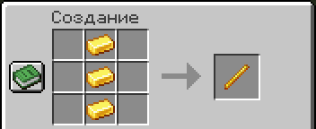

# Редактирование стоек для брони

На сервере можно настраивать стойки для брони - менять позу, видимость и другие параметры.

***

### Как редактировать стойку? 

1. Добудьте 3 золотых слитка
2. Разместите в верстаке 3 золотых слитка в ряд
3. Поздравляем! Вы скрафтили палочку для редактирования стоек

<figure><figcaption></figcaption></figure>

