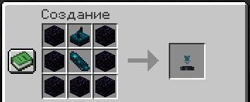
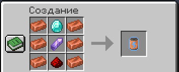

# Технологии

На нашем сервере появились два новых предмета, позволяющих игрокам обезопасить свои постройки от природных катаклизмов, в частности - от падения частиц света.

### Защитный купол

Защитный купол - устройство, создающее энергетическое поле над указанной территорией.

**Принцип работы:**

1. **Установка:** установите блок купола в центре охраняемой зоны.
2. **Активация:** купол автоматически активируется при наличии энергии.
3. **Звезда Незера:** используется для улучшения стадии защитного купола.
4. **Батарейка:** используется для питания защитного купола энергией.

<figure><figcaption></figcaption></figure>

### Батарейка

Батарейка - источник энергии, необходимый для работы защитного купола. Питает защитный купол на **30%**.

<figure><figcaption></figcaption></figure>

