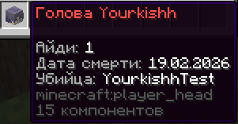

# Выпадение голов

На сервере при убийстве игрока с него выпадает голова. Головы можно использовать:

* `Топором` ( Шанс выпадения 100% )
* `Булава` ( Шанс выпадения 85% )
* `Трезубец` ( Шанс выпадения 65% )
* `Мечом на добычу` ( Шанс выпадения 45% )
* `Если игрок умер от падения` ( Шанс выпадения 10% )

<figure><figcaption></figcaption></figure>

